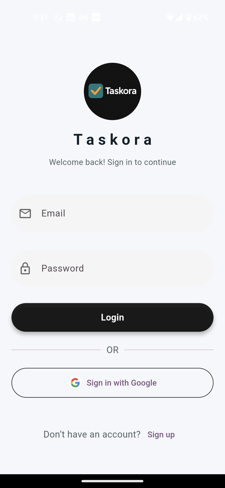
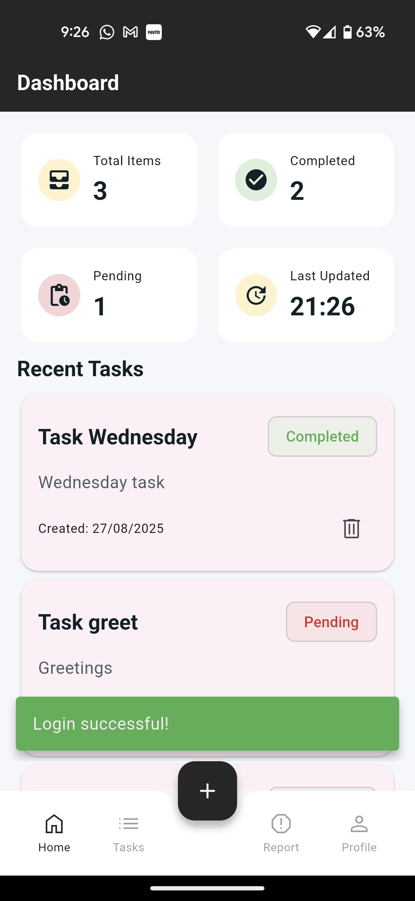
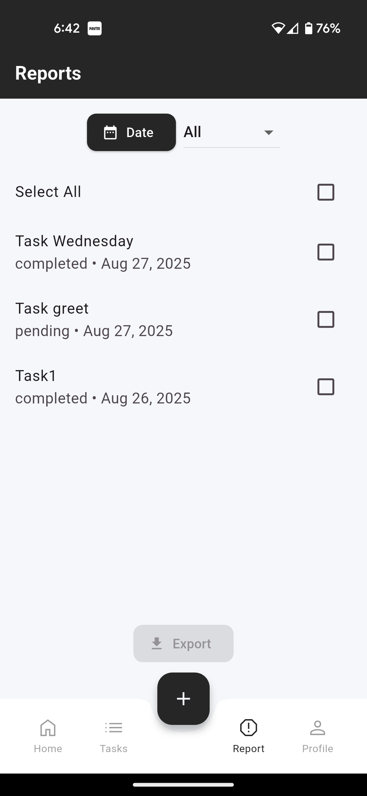
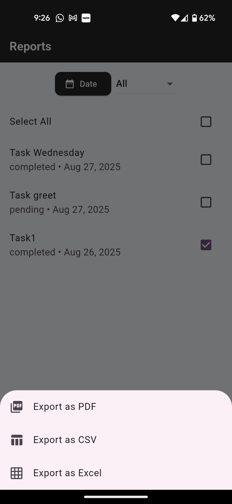

# Taskora

**Taskora** is a Flutter-based productivity and task management app designed to help users **manage, track, and report tasks efficiently**. It features real-time task updates, advanced filtering, and multi-format export functionality (PDF, CSV, Excel).

---

## Features

### Authentication
- Simple login using **Firebase Authentication**.
- Maintains user session until logout.
- Login screen supports **email/password** and **Google Sign-in**.

### Data Management
- Uses **Firestore** as the backend database.
- Supports **CRUD operations** for tasks:
  - **Add**, **Update**, **Delete** tasks.
  - Each task contains:
    - `id` (unique)
    - `title`
    - `description`
    - `status` (Completed / Pending)
    - `createdDate`
- Offline caching allows viewing tasks **without internet**.

### UI & Screens
- **Dashboard/Home Screen**: Displays a summary of tasks (total tasks, completed vs pending).  
- **Task List Screen**: Scrollable list of tasks with **cards and checkboxes**.  
- **Task Details Screen**: View full details of a task by tapping on a card.  
- **Add Task Screen**: Form with validation for creating new tasks.  
- **Reports Screen**:
  - Filter tasks by **date** and **status**.
  - Select multiple tasks for bulk operations.
  - Export tasks as **PDF, CSV, or Excel**.
  - Share or save generated reports.

### Export Formats
- **PDF**: Generated using `pdf` & `printing` packages.
- **CSV**: Generated using `csv` package.
- **Excel**: Generated using `excel` package.

---

## Libraries & Tools

- **State Management & Architecture**
  - `flutter_bloc`: BLoC pattern for managing app state.
  - `bloc` & `equatable`: Core BLoC architecture & value comparisons.
  - `get_it`: Dependency injection for clean architecture.
  
- **Firebase & Authentication**
  - `firebase_core`, `firebase_auth`, `cloud_firestore`: Firebase backend & real-time data.
  - `google_sign_in`: Google login integration.

- **UI & UX**
  - `animated_bottom_navigation_bar` & `google_nav_bar`: Modern bottom navigation bars.
  - `material_symbols_icons`: Access to Google’s Material Symbols icons.
  

- **Data Handling & Export**
  - `intl`: Date formatting for tasks and reports.
  - `pdf` & `printing`: Generate and share PDF reports.
  - `csv` & `excel`: Export tasks as CSV or Excel files.
  - `path_provider`: Access local storage.

- **Extras**
  - `image_picker`: Picking images.

---
## Getting Started

1. **Clone the repository**  
   ```bash
   git clone https://github.com/lijith006/taskora.git
   cd taskora

## App Screenshots







